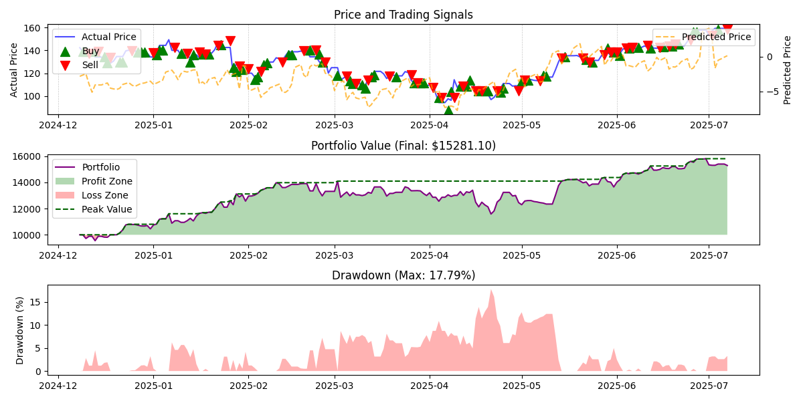

# 📈 Quantitative Trading: Nvidia Stock Prediction 🚀

The project includes a predictive model for forecasting Nvidia's stock price using an LSTM-based neural network. You can directly run the model to generate predictions based on the historical stock data uploaded.

```bash
python -m models.model_loder.lstm_loader
```

Screenshot on 2025-07-08:




- Initial Capital: $10000.00
- Final Value: $15385.39
- Return: 53.85%
- Max Drawdown: 17.80%
- Sharpe Ratio: 1.64
- Win Rate: 55.00%
- Total Trades: 120

---

## 🛠 Installation

Ensure you have **Python 3.8+** installed. Then clone the repository and install the required dependencies:

```bash
git clone https://github.com/kongchenglc/QuantitativeTrading.git
cd QuantitativeTrading
pip install -r requirements.txt
```

### ⚠️ A FRED API key is required

- Head over to https://fred.stlouisfed.org/docs/api/api_key.html to generate an API key
- Once you generate a key, create an `.env` file in the root directory of the repo
- Add your API key here as `FRED_API_KEY=<your key>`

### Conda

1. If you are using Conda, you can create a new environment by running `conda env create -f environment.yml`.
2. This command will create a new Conda environment for you with the dependencies declared in `environment.yml`.
3. Once Step 2 finishes, activate the environment: `conda activate nvidia-quantitative-stock`
4. You can now run the scripts 🎉

---

## 🧠 LSTM Stock Prediction Model

The LSTM model is designed to predict the closing prices of Nvidia stock based on historical price data. It uses a sequence-based model where past prices are used to predict future prices.

### Key Components:

- **LSTM Model:**
  - Input: Historical closing prices (last `n_steps` days).
  - Output: Predicted closing price for the next day.
  - The model is built using PyTorch and consists of an LSTM layer followed by a fully connected layer.
- **Data Preprocessing:**
  - The data is normalized using MinMaxScaler.
  - The dataset is split into training and testing sets, with a rolling window approach for time-series prediction.

### Usage:

1. **Train the Model:**  
Use the `StockPredictor` class to preprocess the data and train the model.

```bash
python main.py
```

Use Optuna to get the best hyperparameters:

```bash
python -m util.optuna_tuner.py
```

2. **Predict:**  

Install the required dependencies. Then, run the following command to generate the predictive trade signal for the next day:

```bash
python -m models.model_loder.lstm_loader
```

---

## 📌 Current Features

- **Data Collection**

  - **Historical Stock Price Analysis:**  
    Utilizes the [Yahoo Finance API](https://finance.yahoo.com/) to fetch Nvidia (NVDA) stock data, while also computing key technical indicators:
    - Simple Moving Averages (SMA)
    - Exponential Moving Averages (EMA)
    - Relative Strength Index (RSI)
    - MACD (Moving Average Convergence Divergence)
    - Bollinger Bands
  - **Macro-Economic Data:**  
    Leverages the [Federal Reserve Economic Data (FRED)](https://fred.stlouisfed.org/) API via the `fredapi` package to obtain:
    - Interest Rates
    - Inflation Rates
    - Unemployment Rates
    - GDP Data
  - **News & Sentiment Analysis:**  
    Scrapes Nvidia-related news from the Google News RSS feed and computes sentiment scores using VADER.

- **Stock Prediction Model (LSTM)**

  - **LSTM-based Stock Price Prediction:**  
    Implements a Long Short-Term Memory (LSTM) model to predict Nvidia's stock closing prices based on historical data.
  - **Features:**
    - Trains on historical stock data, incorporating sequence-based time series analysis.
    - Predicts closing prices for the next day.
